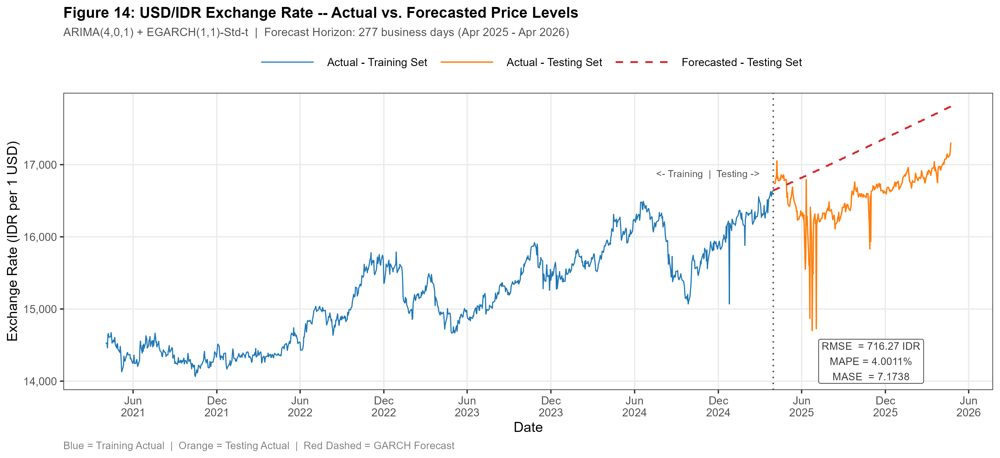
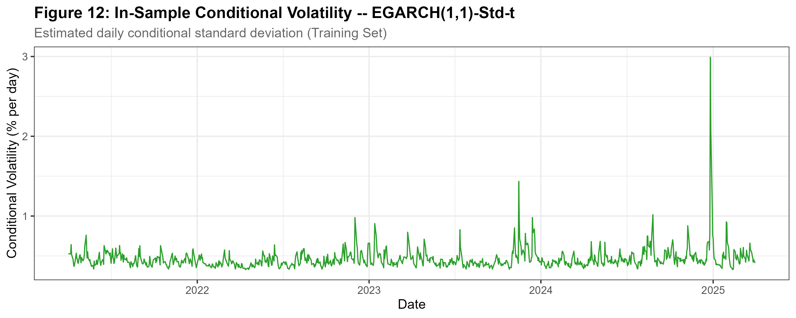

# USD/IDR Exchange Rate Volatility Forecasting

ARIMA(4,0,1)-EGARCH(1,1) model with Student-t innovations, modeling USD/IDR 
exchange rate volatility using 1,319 daily price observations (1,318 valid 
log-return observations), April 2021-April 2026.

## Results

| Metric | Value |
|---|---|
| MAPE | 3.98% |
| RMSE | 713.11 IDR |
| MAE | 656.42 IDR |

## Method
- Train set: 1,041 observations | Test set: 277 observations (strict zero-leakage split)
- Mean equation: ARIMA(4,0,1), selected via exhaustive search (AIC = -7977.49)
- Variance equation: EGARCH(1,1) with Student-t innovations, selected among four 
  GARCH-family candidates (AIC = -8.0370)
- Stationarity confirmed via ADF and Phillips-Perron tests
- Full methodology and interpretation are under review for a Sinta-indexed journal; 
  this repository shares the R implementation and summary results only

## Data
- Source: [Yahoo Finance](https://finance.yahoo.com/quote/IDR=X/history) (USD/IDR, IDR=X)
- Period: 2021-04-01 to 2026-04-23
- File: `usdidr_daily_prices.csv`

## How to run
1. Clone this repository
2. Open `arima_egarch_usdidr_forecast.R` in RStudio
3. Install required packages (uncomment the install block on first run)
4. Run the script — it reads `usdidr_daily_prices.csv` from the same directory